# Metasploitable2 Exploitation - Brute-Forcing, Reverse Shell & Privilege Escalation

**Objective:** To gain initial access to Metasploitable2 by brute-forcing DVWA login credentials, establish a reverse shell, and subsequently escalate privileges to root.

**Skills Demonstrated:**

* Network Reconnaissance and Scanning
* Web Application Brute-Forcing
* Burp Suite Intruder Usage
* File Upload Vulnerability Exploitation
* Reverse Shell Generation and Handling
* Linux Privilege Escalation Techniques (SUID exploitation)
* Shell Stabilization
* System Enumeration

**Tools Used:**

* **Oracle VirtualBox:** For hosting the Metasploitable2 virtual machine.
* **Kali Linux:** The attacking operating system.
* **Nmap:** For network scanning and service enumeration.
* **Gobuster:** For directory and file enumeration on web servers.
* **Burp Suite Intruder:** For automated brute-forcing attacks.
* **Netcat:** For establishing and handling reverse shell connections.
* **GTFOBins:** A resource for privilege escalation techniques.
* **Metasploitable2:** The vulnerable target machine.
* **Flameshot:** For capturing high-quality screenshots throughout the project.
* **CherryTree:** For organizing notes, steps, and observations during the assessment.

---

## Project Walk-through:

### Target Identification:
I powered on my Metasploitable2 virtual machine within Oracle VirtualBox and logged in to identify its IP address.

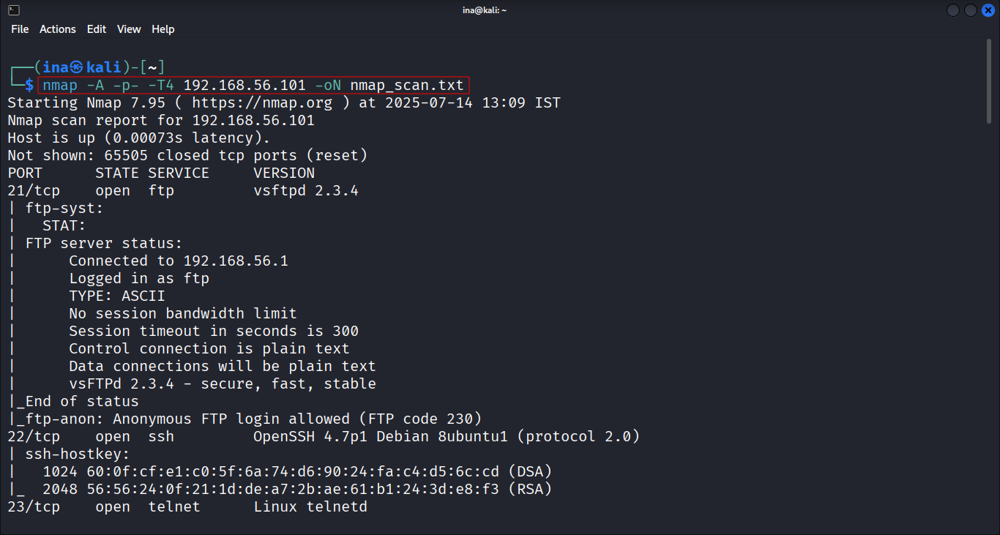

### Network Scan:
I performed an Nmap scan on the target machine. This initial scan was crucial for discovering open ports, running services, and identifying potential entry points. The scan revealed several open ports, including those for web services.

### Directory and File Enumeration with Gobuster:
To uncover hidden directories and files on the web server, I utilized Gobuster. This tool systematically fuzzes directory and file names, helping to map the web application's structure. The scan results revealed `index.php`, which upon inspection, led me to the DVWA (Damn Vulnerable Web Application) instance hosted on the machine. This discovery was significant as DVWA is intentionally vulnerable and an ideal target for penetration testing practice.
Screenshot: Gobuster scan in progress.

### Accessing DVWA Login:
I navigated to the DVWA login page.

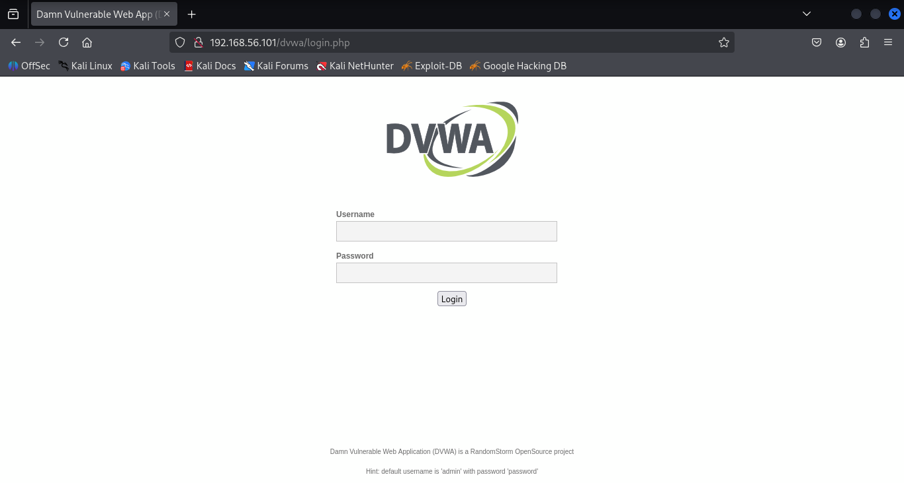

### Intercepting Request:
After attempting to log in with arbitrary credentials, I intercepted the POST request using Burp Suite. This captured request contained the username and password fields, which were essential for the brute-force attack.

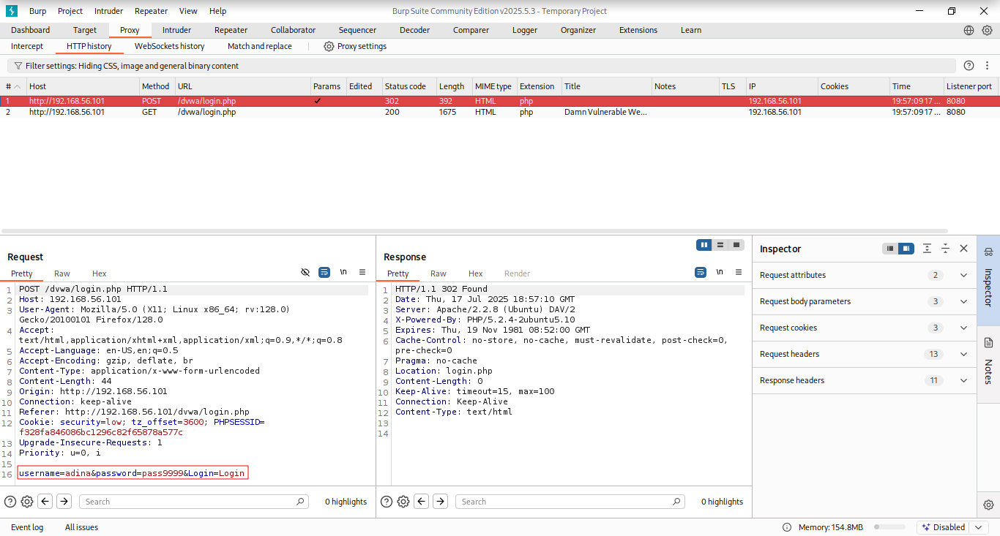

### Brute-Forcing Login with Burp Suite Intruder:
I sent the intercepted login request to Burp Suite Intruder. I selected the "Cluster Bomb" attack type, which allows for simultaneous iteration through multiple payload sets (in this case, usernames and passwords). I defined the payload positions for both the username and password fields. For payloads, I used two custom wordlists: `user.txt` for usernames and `password.txt` for passwords, which I had previously created. To identify successful login attempts, I configured "Grep Match" for "Login failed," allowing Intruder to highlight responses that did not contain this string, indicating a successful login. 

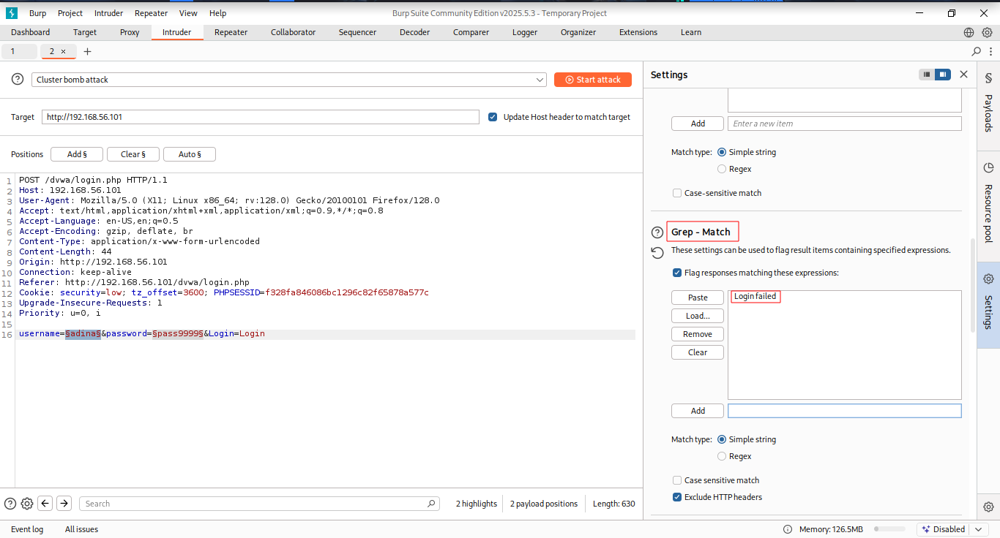

I also set "Redirections" to "Always" to ensure Burp Suite followed any redirects after a successful login.

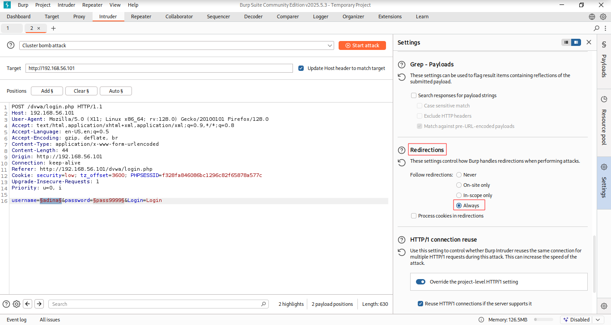

### Executing the attack:
I initiated the Intruder attack.

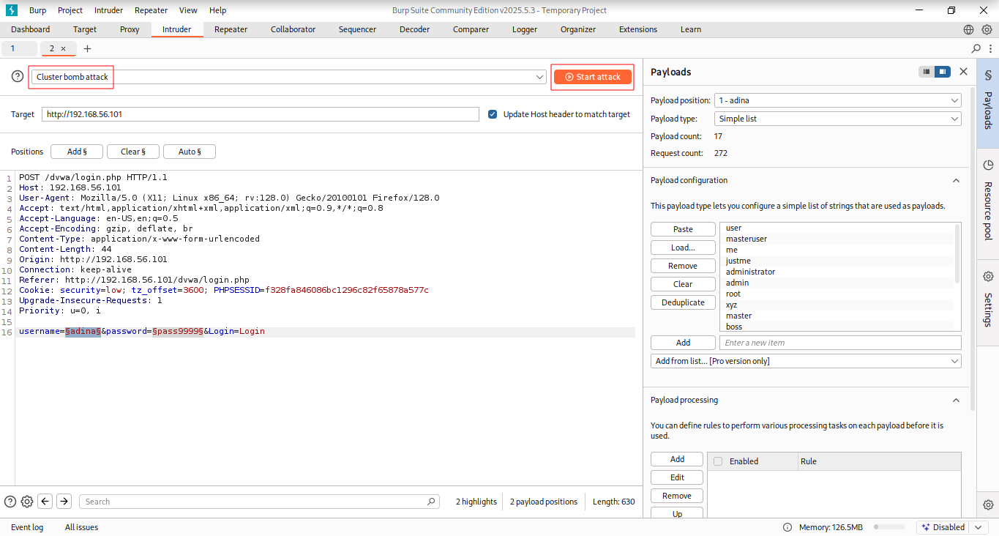

### Analyzing the Attack:
Upon completion, I meticulously analyzed the results. By sorting the responses based on length or the absence of the "Login failed" string, I successfully identified the valid username and password for the DVWA application. I then used these credentials to log in to DVWA.

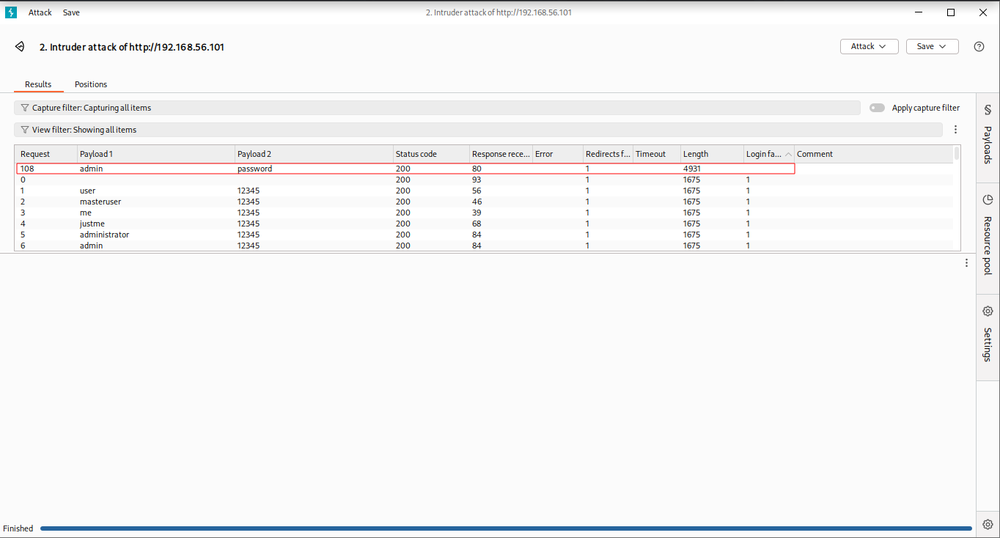

---

## Gaining Initial Access - Reverse Shell Upload

### File Upload Vulnerability Identification:
After logging into DVWA, I observed a file upload functionality within the application. This immediately suggested a potential avenue for uploading a malicious shell.

### Preparing the Reverse Shell:
I located a suitable PHP reverse shell file on my Kali Linux machine (typically found in `/usr/share/webshells/php/`).

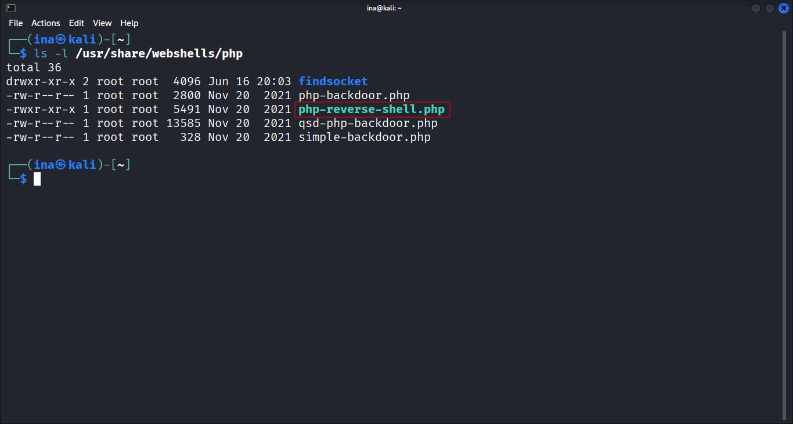

I renamed it to `shell.php` to avoid detection and opened it to modify the IP address and port number. I set the IP to my Kali Linux machine's IP address and the port to 4444, which would be my listener port.

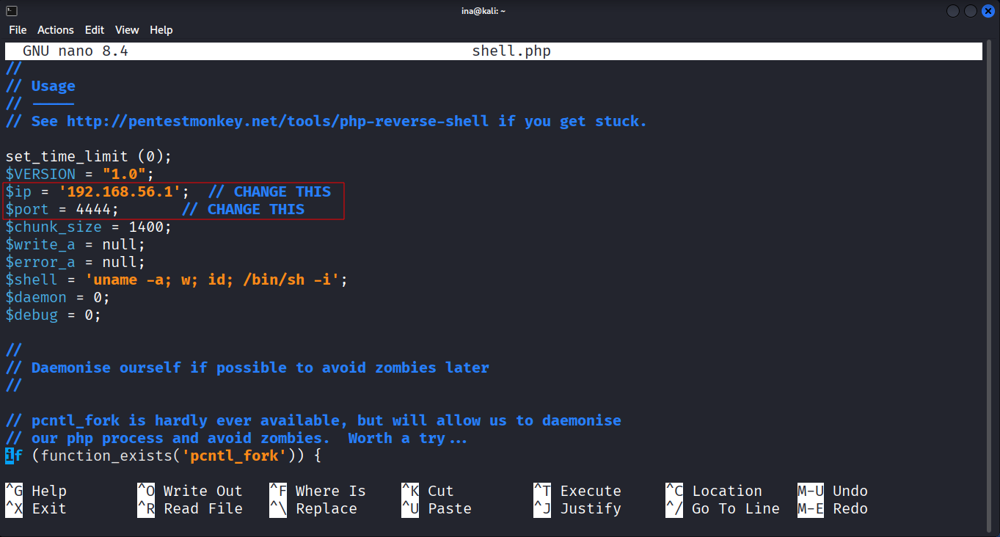

### Setting up a Netcat Listener:
On my Kali Linux machine, I opened a Netcat listener on port 4444, awaiting an incoming connection from the reverse shell.

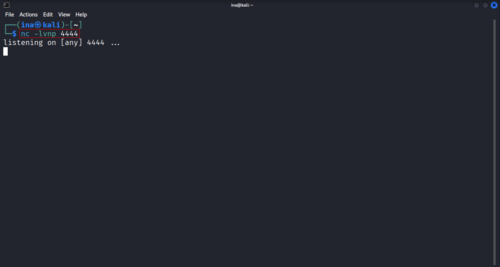

### Uploading the Reverse Shell:
I uploaded the `shell.php` file to the DVWA web application. 

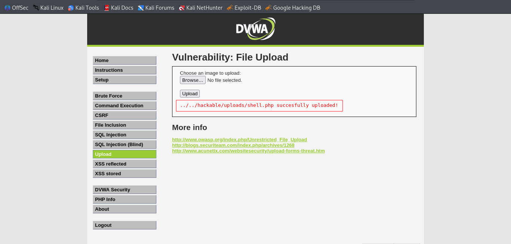

### Triggering the Reverse Shell:

After a successful upload, I triggered the reverse shell by navigating to the file's URL in the browser (e.g.`http://[Metasploitable2_IP]/DVWA/hackable/uploads/shell.php`). This executed the PHP code on the server.

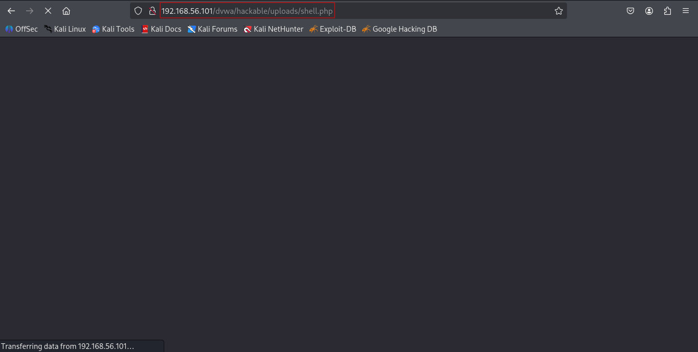

### Establishing a Stabilized Shell:
Upon triggering the payload, I successfully received a reverse shell connection on my Netcat listener, initially as the `www-data` user. To ensure a more functional and interactive shell for further exploitation, I stabilized it using `python -c 'import pty; pty.spawn("/bin/bash")'` and `stty raw -echo; fg`.

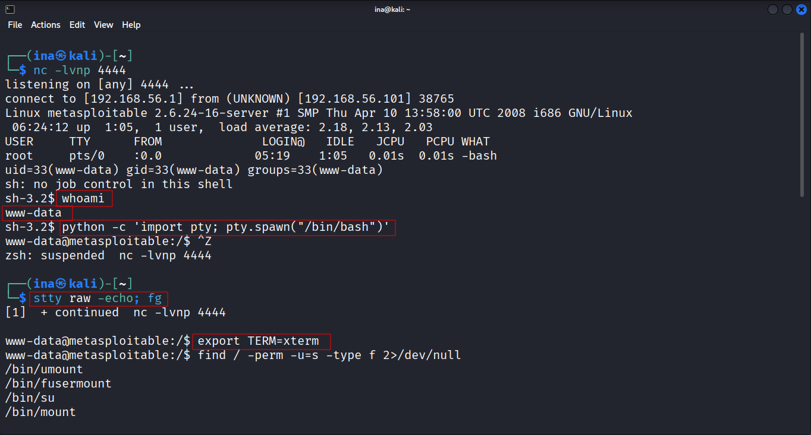

---

## Privilege Escalation to Root

### SUID Bit Enumeration:
To identify potential privilege escalation vectors, I searched for files with the SUID (Set User ID) bit set using `find / -perm -u=s -type f 2>/dev/null`. This command lists executables that run with the permissions of the file owner, regardless of the user executing them. I identified `/usr/bin/nmap` as a potential candidate for exploitation.

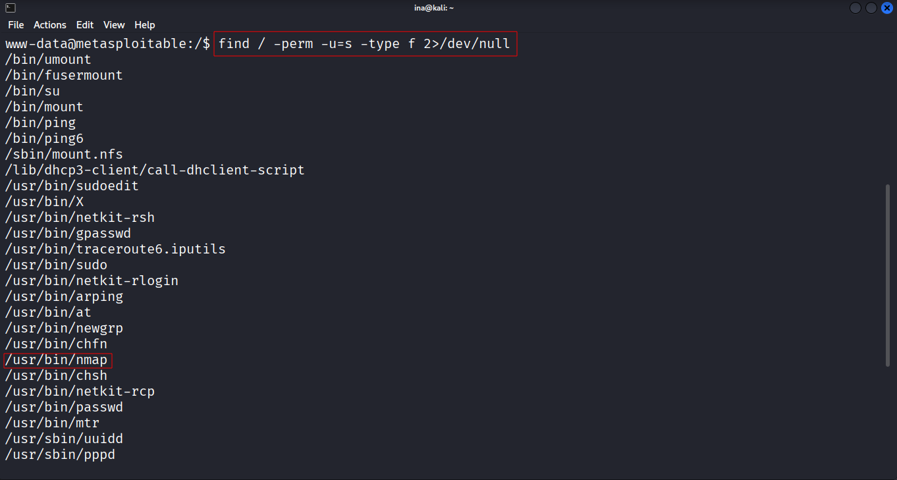

### GTFOBins Consultation:
I consulted GTFOBins (https://gtfobins.github.io/), a curated list of Unix binaries that can be exploited to bypass local security restrictions. I searched for `nmap` and found that certain versions of nmap can be used to escalate privileges, particularly if they are old or misconfigured.

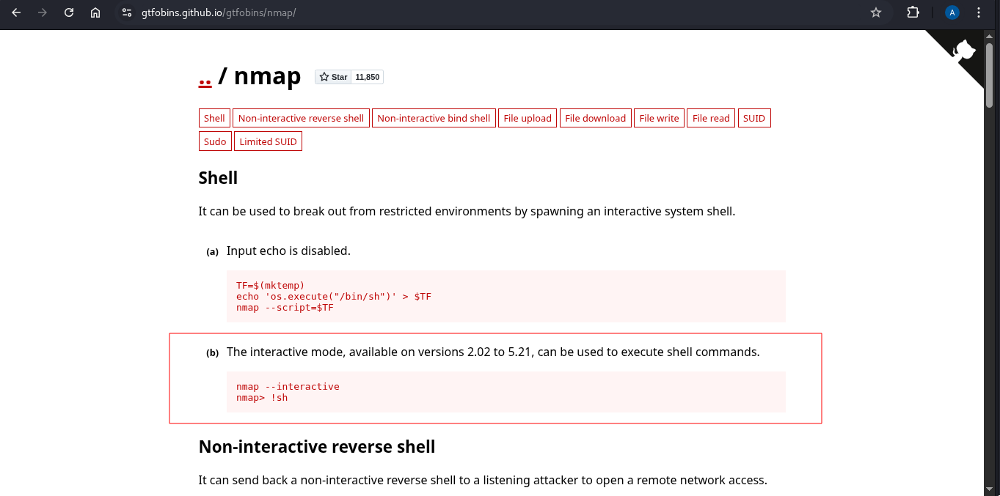

### Nmap Version Check:
I verified the nmap version on Metasploitable2 using `nmap --version`. It confirmed that the version installed was indeed vulnerable according to GTFOBins.

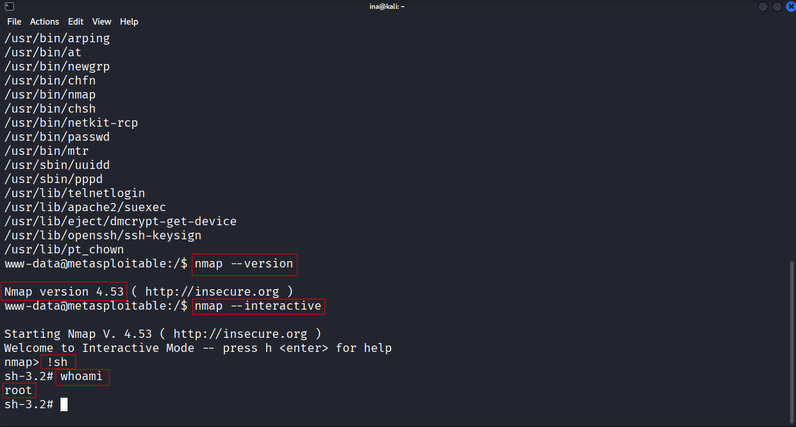

### Root Privilege Escalation:
Following the instructions provided on GTFOBins for the vulnerable nmap version, I executed the specific commands. This technique typically involves using nmap to run commands with root privileges. In this case, the nmap interactive mode allowed me to execute `/bin/bash` with root permissions, effectively granting me a root shell.

